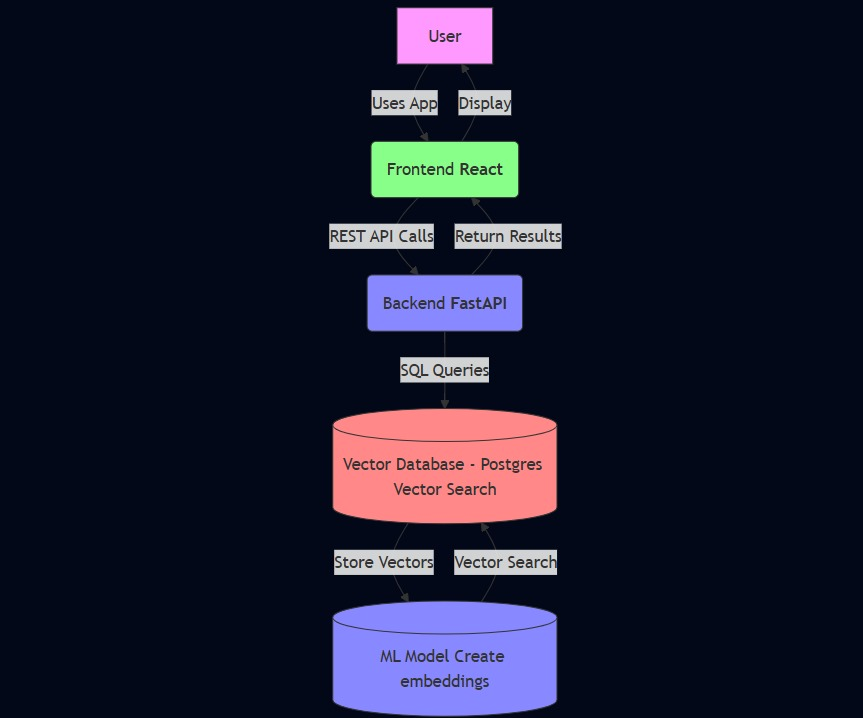

# JTP Product Recommendation System (Text based)

This repository contains a full-stack product recommendation system inspired by BigBasket, featuring a React frontend, a FastAPI backend, and a PostgreSQL database with vector search capabilities (via pgvector). The backend leverages a custom machine learning model for product embeddings and recommendation with the help of embeddings.

---

## Table of Contents

- [Features](#features)
- [Architecture](#architecture)
- [Prerequisites](#prerequisites)
- [Installation](#installation)
- [Project Structure](#project-structure)
- [API Endpoints](#api-endpoints)
- [Troubleshooting](#troubleshooting)

---

## Features

- **Product Recommendations:** Suggests similar products based on vector similarity.
- **Cart Recommendations:** Recommends products based on the user's cart.
- **Random Products:** Fetches a random selection of products.
- **Modern Stack:** FastAPI, PostgreSQL (with pgvector), React, Docker.
- **Embedding Model:** Uses a Keras autoencoder model for product embeddings.

---

## Architecture

```
+-----------+         +-----------+         +-----------+
|  Frontend | <-----> |  Backend  | <-----> | Postgres  |
|  (React)  |  REST   | (FastAPI) |  SQL    | + pgvector|
+-----------+         +-----------+         +-----------+
```

- **Frontend:** React app served via Nginx (Dockerized).
- **Backend:** FastAPI app, exposes REST API, handles ML inference.
- **Database:** PostgreSQL with pgvector extension for similarity search.



---

## Prerequisites

- Docker
- Git
- VSCode (Any other IDE)

---

## Installation and Running the Application

### 1. Clone the Repository

```sh
git clone https://github.com/1aryantyagi/JTP-project
cd JTP-project
```

### 2. Directory Structure

```
JTP-project/
├── backend/
│   ├── app.py
│   ├── main.py
│   ├── migrate.py
│   ├── requirements.txt
│   ├── ML_Model/
│   │   ├── bb_encoder.h5
│   │   ├── BigBasket Products.csv
│   │   └── ...
│   └── Database/
│       └── bigbasket_snapshot.sql
├── frontend/
│   ├── src/
│   ├── public/
│   ├── package.json
│   └── ...
├── docker-compose.yml
└── README.md
```

### 3. Run the docker using:

```sh
docker-compose up --build
```

This will:
- Build the backend and frontend Docker images.
- Start the PostgreSQL database with the pgvector extension and initialize it with sample data.
- Launch the FastAPI backend (on port 8000).
- Serve the React frontend via Nginx (on port 3000).

### 4. Access the Application

**Application will run on `http://localhost:3000`**
- **Frontend:** [http://localhost:3000](http://localhost:3000)
- **Backend API Docs:** [http://localhost:8000/docs](http://localhost:8000/docs)
- **Database:** Accessible inside the `postgres` container.

### 5. Stopping the Application

To stop all services, press `Ctrl+C` in the terminal running Docker Compose, then run:

```sh
docker-compose down
```

---

## Project Structure

- **backend/**: FastAPI app, ML model, database scripts.
- **frontend/**: React app (bootstrapped with Create React App).
- **docker-compose.yml**: Orchestrates all services.
- **README.md**: This file.

---

## API Endpoints

The backend exposes the following endpoints:

- `GET /random_products`  
  Returns a random selection of products.

- `GET /recommend/{product_name}`  
  Returns similar products based on vector similarity.

- `POST /recommend/cart`  
  Returns recommendations based on a user’s cart contents.

See [backend/README.md](backend/README.md) for more details in backend.
See [frontend/README.md](frontend/README.md) for more details in backend.

---

## Troubleshooting

- **Build Failures:**  
  Ensure Docker is running and ports 3000/8000/5432 are free.

- **Database Initialization:**  
  If the database fails to initialize, check the logs for the `postgres` container.

- **Frontend Not Loading:**  
  Make sure the backend is healthy and accessible at `http://localhost:8000`.

- **Rebuilding:**  
  If you change backend or frontend code, re-run `docker-compose up --build`.

---

## Project Screenshots

Login Page - User can Login with the ID or click on register


Registration Page - User can register 


Main Page - User can see various products also they click on Refresh Products to view new products

User can view the products in the cart

User can click on `View Recommendation` or `Add to cart`

User can also Sort the Products on the basis of `price`


Recommendation Page - User can view the Recommended products here

Example:- `Biscuits - Digestive`


Example:- `Pasta Sause - Parmesan & Romano`


Cart Page:- All the Add to cart items can we views here.

Also based on all the items in the cart the recommendation can be viewed in the `Frequently Bought Together` section.


Frequently Bought Together Section
