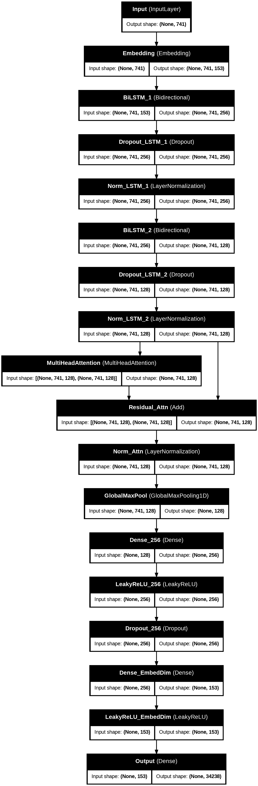

# BigBasket Product Recommendation (Backend)

This repository contains the backend for a product recommendation API built with FastAPI, PostgreSQL (with pgvector), and a custom embedding model. The service provides three main endpoints:

- **`GET /random_products`** — returns a random selection of products  
- **`GET /recommend/{product_name}`** — returns similar products based on vector similarity  
- **`POST /recommend/cart`** — returns recommendations based on a user’s cart contents  

> **Note:** Installation, environment setup, and database initialization are documented in a separate file.

---

## Model Overview

A custom TensorFlow encoder (saved as `bb_encoder.h5`) was trained to convert product metadata into fixed-length embeddings. The training pipeline (in `TechJTP.ipynb`) processes product attributes—such as category, sub-category, brand, and textual description—and learns a dense representation that captures semantic similarity among products.

- **Encoder architecture**: Sequential layers of embedding lookups, dense layers, and (optionally) LSTM layers for text  
- **Output dimension**: 153-dimensional real-valued vector  
- **Training data**: `BigBasket Products.csv` (product metadata)  

Once trained, each product’s embedding is exported to `BigBasket_Products_emb.csv`, which is ingested into PostgreSQL as a `vector` column.

---

## Embedding & Database

- **Embedding generation**  
  1. Load product metadata from CSV  
  2. Preprocess textual fields (tokenization, padding)  
  3. Pass through `bb_encoder.h5` to obtain a embedding  
  4. Save embeddings alongside original attributes in `BigBasket_Products_emb.csv`

- **Database schema**  
  ```sql
  CREATE TABLE products (
    product      TEXT PRIMARY KEY,
    category     TEXT[],
    sub_category TEXT[],
    brand        TEXT,
    sale_price   FLOAT,
    market_price FLOAT,
    type         TEXT[],
    rating       FLOAT,
    description  TEXT,
    embedding    VECTOR(128)
  );

---

## API Endpoints

1. GET `/random_products`

Fetches a random sample of products from the database.

2. GET `/recommend/{product_name}`

Returns up to 7 products similar to the given `product_name`, based on cosine (pgvector `<=>`) similarity.

### Logic Flow:

 -> Fetches embedding for specified product

 -> Finds 12 most similar products using vector similarity

 -> Returns random 7 from top 12 for diversity

3. POST `/recommend/cart`

Generates recommendations based on multiple products in a shopping cart. For each cart item, the top 8 similar products are retrieved, aggregated, de-duplicated, and ranked by frequency of occurrence.

### Algorithm:

1 For each cart product:

    1.1 Fetch top 8 similar items

    1.2 Exclude items already in cart

2 Aggregate recommendations

3 Rank by frequency across all results

4 Return top 12 most frequent items

## Logging & Error Handling

1. **Connection pool retries:** Up to 5 attempts with exponential backoff

2. **Request logging:** All endpoints log entry and errors via Python’s `logging` `module`.

3. **HTTP errors**

## Performance

Typical response times:

1- Random products: <100ms

2- Single product recs: 200-400ms

3- Cart recs: 500-800ms (scales with cart size)

## Model architecture

The model is a hybrid of BiLSTM (Bidirectional LSTM) and Multi-Head Attention, followed by fully connected layers for generating embeddings. The input seems to be a sequence of tokens , and the final output has a shape of (None, 153) for embeddings.

The model uses BiLSTM for sequence understanding, self-attention for focus, and dense layers.

The combination of residuals, dropout, and normalization indicates a well-regularized, deep model.



## Architecture Explain

1. Token Representation (Embedding Layer)

    Each input token (e.g., word/subword) is mapped to a dense vector , capturing initial semantics.

2. Contextual Understanding (BiLSTM Layers)

    Two BiLSTM layers progressively capture forward and backward dependencies in the sequence.

3. Self-Attention (MultiHeadAttention)

    Attention allows the model to weigh the importance of different tokens, refining their interactions beyond simple sequential dependencies.

    Helps especially in capturing long-range dependencies, critical for deep semantic understanding.

4. Residual and Layer Norm

    These are standard tricks (borrowed from transformers) to stabilize training and preserve gradients, improving representational quality.

5. Sequence Pooling (GlobalMaxPooling1D)

    This is crucial for converting sequences to embeddings.

6. Dense Layers + LeakyReLU
    After pooling, the vector is projected into higher dimensions (256 → 153) to become the final embedding vector.
